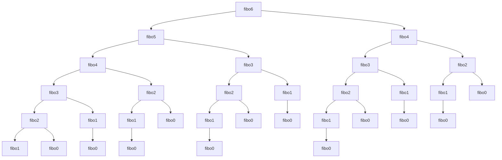

# 再帰関数の実行順序
## 複数回再帰が呼び出される時の実行順
- フィボナッチ数列での例

```mermaid
graph TD;
A[fibo6] --> B[fibo5]
A[fibo6] --> C[fibo4]

B[fibo5] --> D[fibo4]
B[fibo5] --> E[fibo3]

D[fibo4] --> F[fibo3]
D[fibo4] --> G[fibo2]

F[fibo3] --> H[fibo2]
F[fibo3] --> I[fibo1]

H[fibo2] --> J[fibo1]
H[fibo2] --> K[fibo0]

I[fibo1] --> L[fibo0]

G[fibo2] --> M[fibo1]
G[fibo2] --> N[fibo0]

M[fibo1] --> O[fibo0]

E[fibo3] --> P[fibo2]
E[fibo3] --> Q[fibo1]

P[fibo2] --> R[fibo1]
P[fibo2] --> S[fibo0]

R[fibo1] --> T[fibo0]

Q[fibo1] --> U[fibo0]


C[fibo4] --> a[fibo3]
C[fibo4] --> b[fibo2]

a[fibo3] --> c[fibo2]
a[fibo3] --> d[fibo1]

c[fibo2] --> e[fibo1]
c[fibo2] --> f[fibo0]

e[fibo1] --> g[fibo0]

d[fibo1] --> h[fibo0]

b[fibo2] --> i[fibo1]
b[fibo2] --> j[fibo0]

i[fibo1] --> k[fibo0]
```